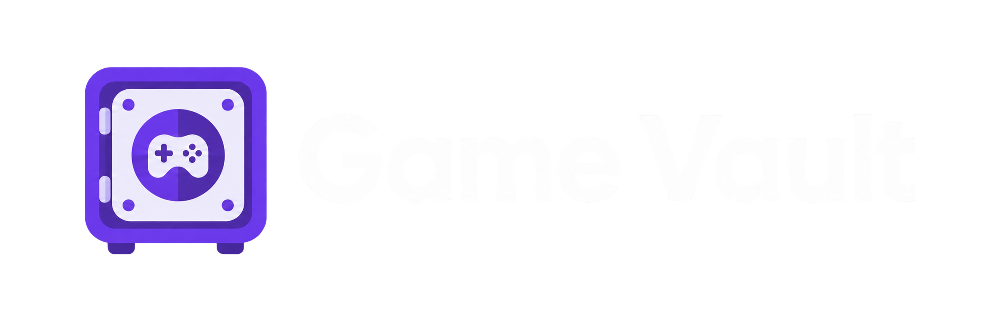

  

  A personal game and console collection catalogue built with Java and React.

## About the project

Game Vault is a responsive web application for recording, browsing, searching, and managing a personal video-game collection.

The application answers practical questions such as:

- Do I already own this game?
- Which platform and edition do I own?
- Is my copy physical or digital?
- Does the physical copy include its original box and manual?
- Which consoles, models, and variants are in my collection?
- How many games do I own for each platform?
- How much have I spent on the collection?

The project is also intended as a focused portfolio exercise in designing a Java REST API and connecting it to a simple, responsive frontend.

## Objective

Build a maintainable catalogue with a completely separated backend and frontend:

- The backend owns collection data, validation, business rules, persistence, search, and statistics.
- The frontend consumes the backend through a versioned JSON REST API.
- The interface works in desktop and mobile browsers.
- A future PWA version can be installed on supported devices.

The first release prioritizes a complete, tested catalogue over advanced integrations.