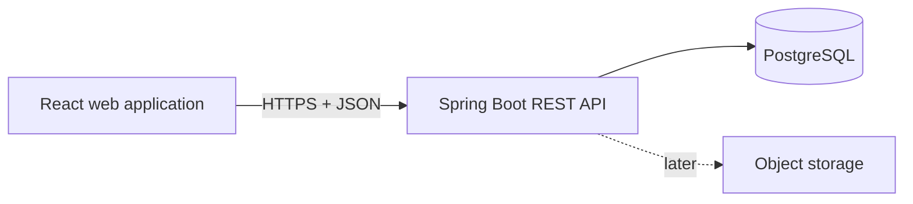
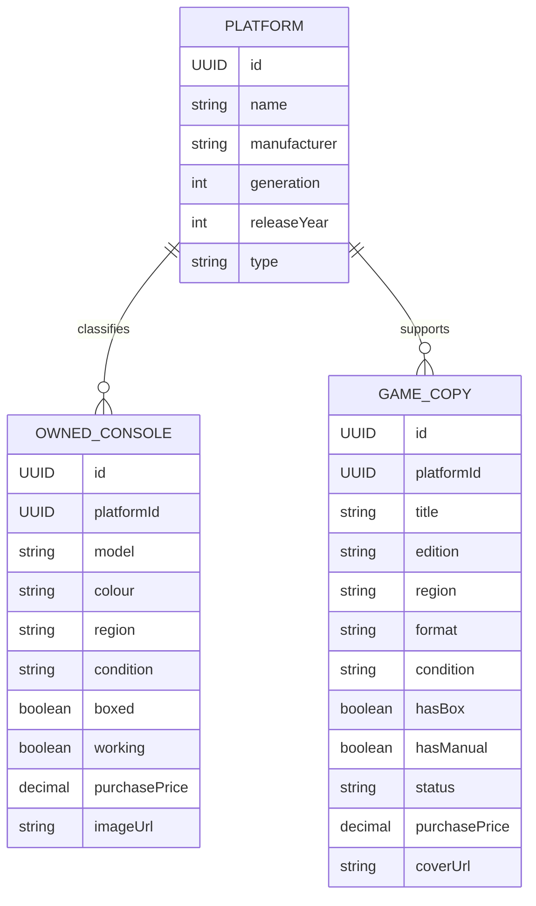

# Game Vault — Technical Project Guide

## 1. Project objective

Game Vault is a personal collection application for recording, browsing, searching, and managing owned video games and consoles.

The first release will run as:

- A responsive desktop website
- A mobile-friendly website
- An installable Progressive Web App (PWA) later, without rebuilding the frontend

The backend and frontend are separate applications communicating through a JSON REST API.

## 2. MVP scope

### Included

- Register and manage gaming platforms
- Register and manage owned consoles
- Register and manage owned game copies
- Browse games in a cover grid
- Browse consoles in a card grid
- Search games and consoles
- Filter games by platform, format, and status
- Filter consoles by platform and condition
- Display collection statistics
- Responsive desktop and mobile layouts
- API documentation and automated backend tests

### Not included in the first version

- Authentication and multiple users
- Native Android or iOS packages
- Image uploads
- Barcode scanning
- External game-database integrations
- Market-price tracking or rarity
- Wish lists
- Social or public collection profiles

For the MVP, covers and console photographs are stored as external image URLs.

## 3. Recommended technologies

### Backend

| Area | Technology |
| --- | --- |
| Language | Java 25 |
| Framework | Spring Boot 4.x |
| HTTP API | Spring Web MVC |
| Persistence | Spring Data JPA |
| Database | PostgreSQL |
| Migrations | Liquibase |
| Validation | Jakarta Bean Validation |
| API documentation | Springdoc OpenAPI / Swagger UI |
| Unit tests | JUnit 5 and Mockito |
| Integration tests | Spring Boot Test, Rest Assured and Testcontainers |
| Build | Maven |
| Local infrastructure | Docker Compose |

### Frontend

| Area | Technology |
| --- | --- |
| Language | TypeScript |
| UI library | React |
| Build tool | Vite |
| Components and styling | Material UI |
| Routing | React Router |
| HTTP client | Native `fetch` |
| Tests | Vitest and React Testing Library |

Keep the frontend deliberately small. Do not introduce Redux, Next.js, Tailwind, Ionic, or complex state-management libraries in the MVP.

### Later mobile options

Start with a responsive web application. After the web version is stable:

1. Add PWA configuration so it can be installed from a browser.
2. Add Capacitor only if publishing through the Android or Apple app stores becomes necessary.

## 4. System architecture



During local development:

| Component | Address |
| --- | --- |
| Frontend | `http://localhost:5173` |
| Backend | `http://localhost:8080` |
| Swagger UI | `http://localhost:8080/swagger-ui.html` |
| PostgreSQL | `localhost:5432` |

The backend should allow the frontend origin through a limited CORS configuration in development. Do not use an unrestricted production CORS policy.

## 5. Repository structure

A monorepo keeps the project easy to run while maintaining application separation.

```text
game-vault/
├── backend/
│   ├── src/main/java/
│   ├── src/main/resources/
│   ├── src/test/java/
│   ├── Dockerfile
│   └── pom.xml
├── frontend/
│   ├── src/
│   ├── public/
│   ├── package.json
│   └── vite.config.ts
├── compose.yaml
├── .env.example
└── README.md
```

The two applications must have independent builds. The frontend must not be copied into the Spring Boot resources directory.

## 6. Domain model

### Key modelling decision

A **platform** is a console type, such as PlayStation 3 or Nintendo DS. An **owned console** is a specific physical device in the collection. A **game copy** is a specific physical or digital version owned by the collector.

A game copy belongs to a platform, not to a specific owned console.



### Platform

| Field | Type | Rules |
| --- | --- | --- |
| `id` | UUID | Generated by the application |
| `name` | String | Required and unique |
| `manufacturer` | String | Required |
| `generation` | Integer | Optional, positive |
| `releaseYear` | Integer | Optional and reasonable year |
| `type` | `PlatformType` | Required |
| `createdAt` | Instant | Generated |
| `updatedAt` | Instant | Generated |

### OwnedConsole

| Field | Type | Rules |
| --- | --- | --- |
| `id` | UUID | Generated |
| `platformId` | UUID | Required, existing platform |
| `model` | String | Required |
| `colour` | String | Optional |
| `region` | `Region` | Required |
| `condition` | `ItemCondition` | Required |
| `boxed` | Boolean | Required |
| `working` | Boolean | Required |
| `serialNumber` | String | Optional |
| `purchaseDate` | LocalDate | Optional, not in the future |
| `purchasePrice` | BigDecimal | Optional, zero or greater |
| `imageUrl` | String | Optional, valid URL |
| `notes` | String | Optional, length-limited |
| `createdAt` | Instant | Generated |
| `updatedAt` | Instant | Generated |

### GameCopy

| Field | Type | Rules |
| --- | --- | --- |
| `id` | UUID | Generated |
| `platformId` | UUID | Required, existing platform |
| `title` | String | Required |
| `edition` | String | Optional |
| `region` | `Region` | Required |
| `format` | `GameFormat` | Required |
| `condition` | `ItemCondition` | Required for physical copies |
| `hasBox` | Boolean | Only meaningful for physical copies |
| `hasManual` | Boolean | Only meaningful for physical copies |
| `status` | `GameStatus` | Required |
| `purchaseDate` | LocalDate | Optional, not in the future |
| `purchasePrice` | BigDecimal | Optional, zero or greater |
| `coverUrl` | String | Optional, valid URL |
| `notes` | String | Optional, length-limited |
| `createdAt` | Instant | Generated |
| `updatedAt` | Instant | Generated |

### Suggested enums

```java
public enum PlatformType {
    HOME_CONSOLE,
    HANDHELD,
    HYBRID
}

public enum GameFormat {
    PHYSICAL,
    DIGITAL
}

public enum GameStatus {
    BACKLOG,
    PLAYING,
    COMPLETED,
    ABANDONED
}

public enum ItemCondition {
    POOR,
    FAIR,
    GOOD,
    VERY_GOOD,
    EXCELLENT,
    NEW
}

public enum Region {
    PAL,
    NTSC_U,
    NTSC_J,
    REGION_FREE,
    OTHER
}
```

Do not prevent two copies of the same game from being added. The collector may own different regions, editions, or conditions.

## 7. Backend package structure

Organize code by feature rather than creating only global controller, service, and repository packages.

```text
com.caiosousa.gamevault
├── platform/
│   ├── PlatformController.java
│   ├── PlatformService.java
│   ├── PlatformRepository.java
│   ├── PlatformEntity.java
│   └── dto/
├── console/
│   ├── ConsoleController.java
│   ├── ConsoleService.java
│   ├── ConsoleRepository.java
│   ├── OwnedConsoleEntity.java
│   └── dto/
├── game/
│   ├── GameController.java
│   ├── GameService.java
│   ├── GameRepository.java
│   ├── GameCopyEntity.java
│   └── dto/
├── dashboard/
├── shared/
│   ├── error/
│   └── config/
└── GameVaultApplication.java
```

Use DTOs at the HTTP boundary. Do not expose JPA entities directly from controllers.

## 8. REST API contract

Use `/api/v1` as the API prefix.

### Platforms

| Method | Path | Purpose |
| --- | --- | --- |
| `GET` | `/api/v1/platforms` | List platforms |
| `GET` | `/api/v1/platforms/{id}` | Get one platform |
| `POST` | `/api/v1/platforms` | Create a platform |
| `PUT` | `/api/v1/platforms/{id}` | Replace platform details |
| `DELETE` | `/api/v1/platforms/{id}` | Delete an unused platform |

### Games

| Method | Path | Purpose |
| --- | --- | --- |
| `GET` | `/api/v1/games` | Search, filter, sort, and paginate games |
| `GET` | `/api/v1/games/{id}` | Get one game copy |
| `POST` | `/api/v1/games` | Create a game copy |
| `PUT` | `/api/v1/games/{id}` | Replace game-copy details |
| `DELETE` | `/api/v1/games/{id}` | Delete a game copy |

Example query:

```http
GET /api/v1/games?query=mario&platformId=4b7...&format=PHYSICAL&status=COMPLETED&page=0&size=20&sort=title,asc
```

### Consoles

| Method | Path | Purpose |
| --- | --- | --- |
| `GET` | `/api/v1/consoles` | Search, filter, sort, and paginate consoles |
| `GET` | `/api/v1/consoles/{id}` | Get one owned console |
| `POST` | `/api/v1/consoles` | Create an owned console |
| `PUT` | `/api/v1/consoles/{id}` | Replace console details |
| `DELETE` | `/api/v1/consoles/{id}` | Delete an owned console |

Example query:

```http
GET /api/v1/consoles?query=slim&platformId=4b7...&condition=EXCELLENT&page=0&size=20
```

### Dashboard

| Method | Path | Purpose |
| --- | --- | --- |
| `GET` | `/api/v1/dashboard/summary` | Return collection totals and recent items |

Example response:

```json
{
  "totalGames": 126,
  "totalConsoles": 9,
  "physicalGames": 103,
  "digitalGames": 23,
  "completedGames": 45,
  "backlogGames": 61,
  "amountSpentOnGames": 870.50,
  "amountSpentOnConsoles": 374.50,
  "gamesByPlatform": [
    {
      "platformId": "d29a2e37-86a9-4fde-81ad-f742abec1686",
      "platformName": "PlayStation 3",
      "count": 34
    }
  ],
  "recentGames": [],
  "recentConsoles": []
}
```

Call monetary totals **amount spent**, not **collection value**, because the MVP does not obtain current market prices.

## 9. Request and response design

Example request:

```json
{
  "title": "LittleBigPlanet",
  "platformId": "d29a2e37-86a9-4fde-81ad-f742abec1686",
  "edition": "Standard",
  "region": "PAL",
  "format": "PHYSICAL",
  "condition": "VERY_GOOD",
  "hasBox": true,
  "hasManual": true,
  "status": "COMPLETED",
  "purchaseDate": "2026-07-18",
  "purchasePrice": 8.50,
  "coverUrl": "https://example.com/littlebigplanet.jpg",
  "notes": "Portuguese cover"
}
```

Example response:

```json
{
  "id": "8caa31b3-e8b6-4317-af67-6cfba70ee9e6",
  "title": "LittleBigPlanet",
  "platform": {
    "id": "d29a2e37-86a9-4fde-81ad-f742abec1686",
    "name": "PlayStation 3"
  },
  "edition": "Standard",
  "region": "PAL",
  "format": "PHYSICAL",
  "condition": "VERY_GOOD",
  "hasBox": true,
  "hasManual": true,
  "status": "COMPLETED",
  "purchaseDate": "2026-07-18",
  "purchasePrice": 8.50,
  "coverUrl": "https://example.com/littlebigplanet.jpg",
  "notes": "Portuguese cover",
  "createdAt": "2026-08-22T10:15:30Z",
  "updatedAt": "2026-08-22T10:15:30Z"
}
```

### Pagination format

Return a stable application-owned format rather than exposing Spring's internal `Page` JSON structure.

```json
{
  "content": [],
  "page": 0,
  "size": 20,
  "totalElements": 0,
  "totalPages": 0
}
```

### Error format

Use RFC 9457-style problem details.

```json
{
  "type": "https://game-vault.app/problems/validation-error",
  "title": "Validation failed",
  "status": 400,
  "detail": "One or more fields are invalid.",
  "instance": "/api/v1/games",
  "errors": {
    "title": "must not be blank",
    "purchasePrice": "must be greater than or equal to zero"
  }
}
```

Expected status codes:

- `200 OK` for successful reads and updates
- `201 Created` for successful creation, including a `Location` header
- `204 No Content` for successful deletion
- `400 Bad Request` for invalid input
- `404 Not Found` for missing resources
- `409 Conflict` when deleting a platform still in use
- `500 Internal Server Error` for unexpected failures

## 10. Frontend structure

```text
frontend/src/
├── api/
│   ├── apiClient.ts
│   ├── gamesApi.ts
│   ├── consolesApi.ts
│   └── platformsApi.ts
├── components/
│   ├── AppLayout.tsx
│   ├── GameCard.tsx
│   ├── ConsoleCard.tsx
│   ├── LoadingIndicator.tsx
│   ├── EmptyState.tsx
│   └── ConfirmDialog.tsx
├── pages/
│   ├── DashboardPage.tsx
│   ├── GamesPage.tsx
│   ├── GameDetailsPage.tsx
│   ├── GameFormPage.tsx
│   ├── ConsolesPage.tsx
│   ├── ConsoleDetailsPage.tsx
│   └── ConsoleFormPage.tsx
├── types/
│   ├── Game.ts
│   ├── Console.ts
│   ├── Platform.ts
│   └── Page.ts
├── theme.ts
├── App.tsx
└── main.tsx
```

### Routes

| Frontend route | Page |
| --- | --- |
| `/` | Dashboard |
| `/games` | Game catalog |
| `/games/new` | Add game |
| `/games/:id` | Game details |
| `/games/:id/edit` | Edit game |
| `/consoles` | Console catalog |
| `/consoles/new` | Add console |
| `/consoles/:id` | Console details |
| `/consoles/:id/edit` | Edit console |

### Required UI states

Every data-driven page should explicitly support:

- Loading
- Success with data
- Success with an empty collection
- No search results
- Backend error
- Validation error

### Responsive behaviour

- Desktop navigation appears at the top.
- Mobile navigation appears at the bottom.
- Game and console cards use CSS Grid with automatic wrapping.
- Forms use one column on mobile.
- Important buttons remain easy to reach and tap.
- The interface must not scroll horizontally on a phone.

## 11. Testing strategy

### Backend unit tests

Test business rules in service classes:

- Reject a missing platform
- Reject a negative purchase price
- Reject physical-copy-only fields for a digital game, or normalize them to `false`
- Allow multiple editions or regions of the same title
- Prevent deletion of a platform in use
- Calculate dashboard totals correctly

### Backend integration tests

Use Testcontainers with PostgreSQL for:

- Repository queries
- Search and combined filters
- Pagination and sorting
- Database constraints
- Controller request and response contracts
- Error responses

Avoid H2 for persistence integration tests because its behaviour can differ from PostgreSQL.

### Frontend tests

Keep frontend tests focused:

- A game card renders its important information
- The catalog renders API results
- Loading and error states appear
- The form produces the expected request body
- Physical-only fields appear when physical format is selected

## 12. Local development

### PostgreSQL through Docker Compose

```yaml
services:
  postgres:
    image: postgres:17
    environment:
      POSTGRES_DB: game_vault
      POSTGRES_USER: game_vault
      POSTGRES_PASSWORD: local_password
    ports:
      - "5432:5432"
    volumes:
      - game_vault_data:/var/lib/postgresql/data

volumes:
  game_vault_data:
```

Do not commit real secrets. Commit an `.env.example` containing only safe placeholders.

### Backend configuration

```yaml
spring:
  datasource:
    url: jdbc:postgresql://localhost:5432/game_vault
    username: game_vault
    password: local_password
  jpa:
    hibernate:
      ddl-auto: validate
  flyway:
    enabled: true
```

Use Flyway as the source of truth for the schema. Do not use Hibernate to create or update the production schema.

### Frontend configuration

```dotenv
VITE_API_BASE_URL=http://localhost:8080/api/v1
```

Create one API wrapper so the base URL is not repeated throughout the application:

```ts
const API_BASE_URL = import.meta.env.VITE_API_BASE_URL;

export async function apiFetch<T>(path: string): Promise<T> {
  const response = await fetch(`${API_BASE_URL}${path}`);

  if (!response.ok) {
    throw new Error(`Request failed with status ${response.status}`);
  }

  return response.json() as Promise<T>;
}
```

## 13. Implementation plan

### Day 1 — Foundation

- Create the monorepo folders
- Generate the Spring Boot project
- Create the React/Vite/TypeScript project
- Configure Docker Compose and PostgreSQL
- Add the first Flyway migration
- Implement the platform entity and repository
- Confirm the API through Swagger

### Day 2 — Game backend

- Implement game entity, DTOs, repository, service, and controller
- Add validation and error handling
- Add search, filtering, sorting, and pagination
- Add service and controller tests

### Day 3 — Console backend

- Implement console entity, DTOs, repository, service, and controller
- Add filters and pagination
- Add dashboard queries
- Add integration tests with Testcontainers

### Day 4 — Frontend foundation and games

- Configure Material UI theme and React Router
- Build desktop and mobile navigation
- Build game catalog and card components
- Connect the game list to the API
- Implement loading, empty, and error states

### Day 5 — Forms and consoles

- Build create/edit game form
- Build console catalog and cards
- Build create/edit console form
- Add delete confirmation dialogs

### Day 6 — Dashboard and responsiveness

- Build dashboard summary cards
- Display games per platform and recent items
- Test common phone widths
- Improve validation feedback and accessibility

### Day 7 — Verification and delivery

- Run all automated tests
- Test from a clean database
- Add seed/demo data
- Fix mobile layout issues
- Add README run instructions
- Capture screenshots
- Document deliberate MVP limitations

## 14. Epics and core user stories

### Epic A — Platform management

- As a collector, I want to view platforms so I can organize my collection.
- As a collector, I want to create and edit platforms so games and consoles use accurate platform information.
- As a collector, I want deletion blocked when a platform is still in use so collection data is protected.

### Epic B — Game collection

- As a collector, I want to register a game copy so I can record what I own.
- As a collector, I want to browse games as covers so the collection feels like a game library.
- As a collector, I want to edit or delete a game copy so the catalog remains accurate.
- As a collector, I want to store different editions and regions of the same title so distinct copies are preserved.

### Epic C — Console collection

- As a collector, I want to register an owned console with its model, condition, and box status.
- As a collector, I want to browse console cards so I can see my hardware collection.
- As a collector, I want to update or remove a console when my collection changes.

### Epic D — Discovery

- As a collector, I want to search by game title so I can check whether I already own a game.
- As a collector, I want to combine filters so I can focus on a specific part of the collection.
- As a collector, I want to sort results so I can browse them in a useful order.

### Epic E — Dashboard

- As a collector, I want to see the total games and consoles I own.
- As a collector, I want to see the amount I have spent.
- As a collector, I want to see games grouped by platform.
- As a collector, I want to revisit recently added items.

### Epic F — Responsive experience

- As a collector, I want to use the catalog from my phone while shopping.
- As a collector, I want clear loading, empty, validation, and error states.

## 15. Definition of done for the MVP

The MVP is complete when:

1. Backend and frontend build independently.
2. PostgreSQL starts through Docker Compose.
3. Migrations initialize a clean database.
4. Platforms, games, and consoles can be created, read, edited, and deleted through the UI.
5. Games and consoles can be searched and filtered.
6. The dashboard displays correct database-derived statistics.
7. The UI works on desktop and common mobile widths.
8. Invalid input receives useful field-level feedback.
9. Core backend business rules have automated tests.
10. The README explains how to run the complete project locally.

## 16. First actions

Start in this order:

1. Create the repository and the `backend` and `frontend` directories.
2. Generate the Spring Boot project with only the necessary dependencies.
3. Start PostgreSQL and connect the backend.
4. Define the Flyway schema for platforms, owned consoles, and game copies.
5. Implement the platform and game APIs before writing frontend code.
6. Verify every endpoint using Swagger.
7. Scaffold the React application and reproduce the game-catalog mockup using static data.
8. Replace the static data with API calls.
9. Add console screens, forms, dashboard, and responsive adjustments.

Keep the first release intentionally small. A complete, tested catalog is more valuable than an unfinished application containing authentication, third-party APIs, native packaging, and price tracking.
